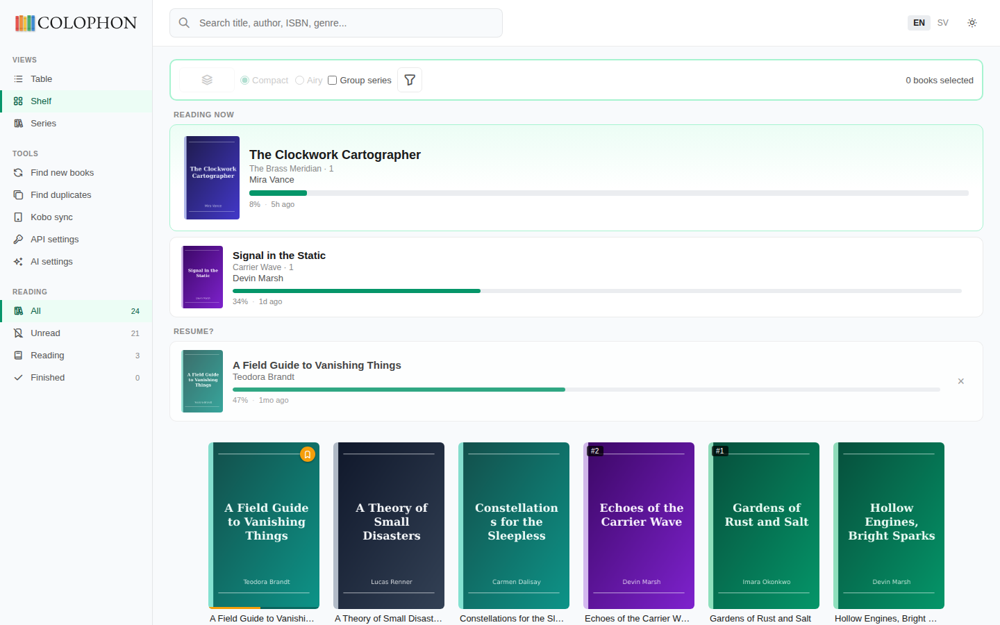
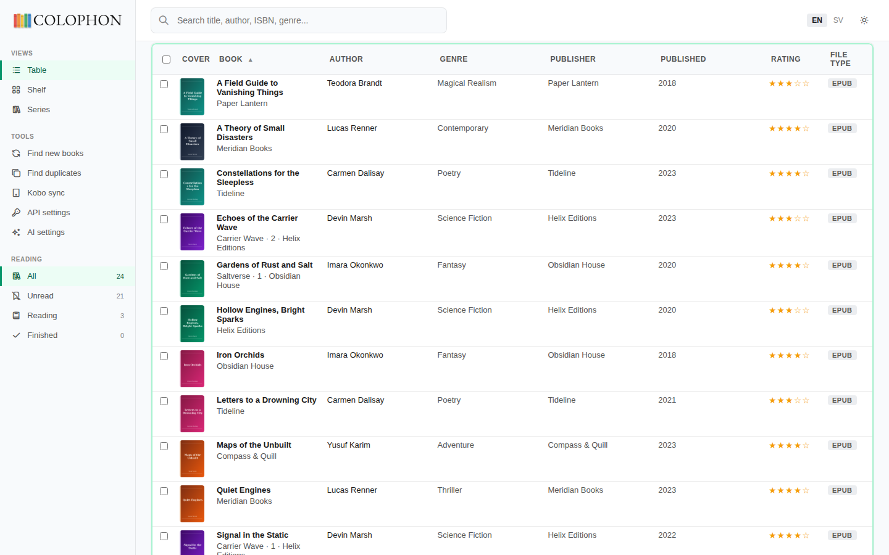
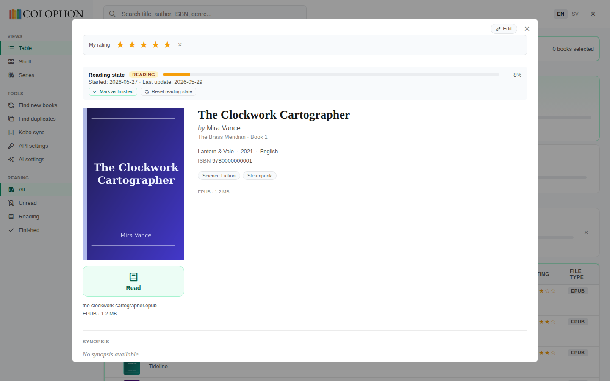
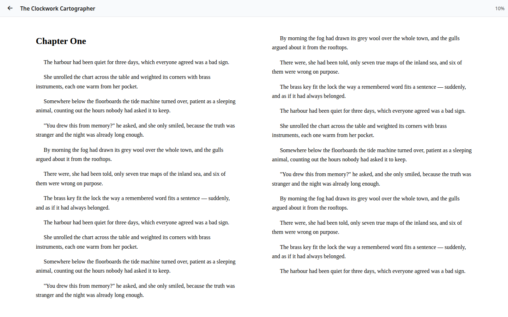

# Colophon — self-hosted e-book metadata manager with Kobo wireless sync

[](https://www.python.org/) [](https://flask.palletsprojects.com/) [](https://www.docker.com/) [](LICENSE) [](https://github.com/cgillinger/colophon/releases) [](#setting-up-kobo-sync)

**Colophon — the e-book manager.** A self-hosted web app that turns a messy folder of e-book files into a clean, browsable library and syncs it to a Kobo e-reader over WiFi. (Not the printing/publishing term — this is the software.)

Colophon scans a folder of e-book files (EPUB, MOBI, AZW3, KEPUB, PDF, CBZ, CBR), fetches and merges metadata from several sources (Google Books, Hardcover, Open Library, Wikidata, Wikipedia, LIBRIS, Calibre), uses AI to detect series, finds cover art, and lets a Kobo e-reader sync the whole library over WiFi.

This is a personal project I built for my own library. I've published it in case someone else has the same problem and can use it as a head start. Runs in one Docker container, MIT-licensed, no telemetry. Think of it as a lightweight, metadata-focused alternative to Calibre and Calibre-Web that plays nicely with Komga, Kavita and other servers that read embedded metadata.

---

## Screenshots

> Sample library — the books, covers and authors shown are fictional placeholders.

**Shelf view** — the library as a cover wall, with a "Reading now" band that picks up where you left off.



**Table view** — a sortable, filterable metadata table.



**Book details** — metadata, reading state, rating, and a one-tap reader.



**In-browser reader** — read EPUBs in any browser; progress syncs back to your Kobo.



---

## What it does

- Scans a book folder and builds a catalogue
- Adds books by drag-and-drop or a file picker — batch upload, no rescan needed; freshly added books wear a "New" badge for a while
- Fetches metadata from seven sources (Google Books, Hardcover, Open Library, Wikidata, Wikipedia, LIBRIS, Calibre) and merges them field by field
- Detects series with AI (Mistral, OpenAI, DeepSeek, or local Ollama)
- Finds covers from Open Library, Google Books, Hardcover, Wikidata, DuckDuckGo
- Writes metadata back into the files so other tools see the same data
- Keeps authors consistent — one canonical entry per author, spelling variants auto-linked, typos flagged for review, one-click merge/rename that relabels every book, with optional Wikidata verification
- Groups multiple formats of the same book as one entry
- Syncs to a Kobo over WiFi — covers, downloads, reading progress
- Reads EPUBs in the browser, with progress synced to your Kobo
- UI in English and Swedish

## What it doesn't do

- Render comics page by page (Komga and Kavita do that well)
- Multi-user accounts
- OPDS
- Internet-facing auth (it's a LAN tool; Kobo sync uses path tokens)
- Backups — it writes to your files, so keep your own

---

## How it compares

If you've searched for any of these, Colophon is aimed at you:

- **A Calibre / Calibre-Web alternative** when you mainly want clean metadata, covers and a nice library view, without running the full Calibre desktop stack.
- **Wireless Kobo sync for a self-hosted library** — point a Kobo at your own catalogue instead of the Kobo store, and get covers, downloads and reading-progress sync over WiFi. No cable after setup.
- **A metadata front-end for Komga or Kavita** — Colophon writes metadata *back into the files*, so the server you already run picks up the same titles, authors, series and covers.
- **An in-browser EPUB reader** with reading progress that syncs to and from your Kobo.

It is *not* a comics page-reader, a multi-user server, or an internet-facing app — see [What it doesn't do](#what-it-doesnt-do).

---

## Quick start

```bash
git clone https://github.com/cgillinger/colophon.git
cd colophon
cp .env.example .env
# Set at least COLOPHON_SECRET_KEY
docker compose up -d
```

Open `http://localhost:5000`.

---

## Environment variables

All variables are read from `.env` (loaded via `env_file` in `docker-compose.yml`).

| Variable | Required | Default | Description |
|---|---|---|---|
| `COLOPHON_SECRET_KEY` | Yes | — | Flask session secret |
| `COLOPHON_LIBRARY_DIR` | No | `/books` | Book folder inside the container |
| `COLOPHON_DATA_DIR` | No | `/data` | Data folder (database, covers) inside the container |
| `COLOPHON_LIBRARY_HOST` | No | `./bibliotek` | Host path mounted as the book folder |
| `COLOPHON_DATA_HOST` | No | `./data` | Host path mounted as the data folder |
| `COLOPHON_LOG_LEVEL` | No | `INFO` | `DEBUG`, `INFO`, `WARNING`, `ERROR`, `CRITICAL` |
| `COLOPHON_PUBLIC_URL` | For Kobo sync | — | URL the Kobo uses to reach Colophon, e.g. `http://192.168.x.x:5000` — include the port |
| `COLOPHON_GOOGLE_BOOKS_KEY` | No | — | Google Books API key |
| `COLOPHON_AI_API_URL` | No | Mistral URL | AI chat completions endpoint |
| `COLOPHON_AI_API_KEY` | No | — | AI provider API key |
| `COLOPHON_AI_MODEL` | No | `mistral-small-latest` | AI model name |
| `COLOPHON_UPSTREAM_DIR` | No | — | Upstream library path inside the container (for sync) |
| `COLOPHON_MAX_UPLOAD_MB` | No | `1024` | Max size per uploaded file (in-app upload) |
| `COLOPHON_NEW_BADGE_DAYS` | No | `14` | Days a newly added book shows the "New" badge |

All API keys can also be set in the web UI under **Settings → API settings**. UI values take priority over environment variables.

---

## Metadata sources

Colophon queries these in a progressive flow and merges the results **field by field** (the best value per field wins, with provenance kept). Each can be toggled in **Settings → API settings**.

| Source | Key required | What it adds |
|---|---|---|
| Embedded file | No | Title, author and series already inside the e-book — treated as high-trust |
| Google Books | Optional key | Title, author, description, ISBN, categories |
| Hardcover | Optional token | Series, genres, synopsis and rating — strong for popular English titles |
| Open Library | No | Subjects, synopsis and ISBNs — strong for older or obscure titles |
| Wikidata | No | Structured series **and position in the series**, genre, author, date |
| Wikipedia | No | Fast description and a thumbnail cover as a fallback |
| LIBRIS (KB) | No | Swedish national bibliography — authoritative Swedish title/author/publisher/ISBN |
| Calibre | No | Deep tier via Calibre's own metadata plugins (Goodreads and others) |

## Cover sources

| Source | Key required | Searches by |
|---|---|---|
| Open Library | No | ISBN |
| Google Books | No | ISBN, title, author |
| Hardcover | Optional token | ISBN, title, author |
| Wikidata/Commons | No | ISBN |
| DuckDuckGo | No | Title, author |

## AI providers

| Provider | URL | Free tier |
|---|---|---|
| Mistral (recommended) | `https://api.mistral.ai/v1/chat/completions` | ~1M tokens/month |
| OpenAI | `https://api.openai.com/v1/chat/completions` | Pay-as-you-go |
| DeepSeek | `https://api.deepseek.com/v1/chat/completions` | Very cheap |
| Ollama (local) | `http://localhost:11434/v1/chat/completions` | Free, no key needed |

---

## Managing authors

Colophon keeps **one canonical entry per author** so every book by the same
person is labelled identically — even when the source files spell the name
differently. The **Authors** page (in the sidebar) is where you curate that
registry. Spelling variants are auto-linked to the canonical entry, and
near-identical entries are flagged as likely duplicates.

Each entry has a status that controls whether the name is written back into
your files:

| Status | Meaning | Written to files? |
|---|---|---|
| Tentative | Created automatically from file metadata during a scan or upload | No — DB only |
| Confirmed | You confirmed the spelling is correct | Yes |
| Authority-linked | Verified against Wikidata; stores the QID, VIAF and LIBRIS ids | Yes |

What you can do from the page:

- **Filter to unconfirmed** and tick the checkboxes to **confirm several at
  once** — the fastest way to clear out freshly-scanned tentative entries.
- **Rename** or **merge** an entry — both cascade, relabelling every linked
  book in one sweep.
- **Verify** an entry against Wikidata to anchor it with authority ids.
- For likely-duplicate pairs, merge with one click, or **Ask AI** whether the
  two names are the same person (advisory only — AI proposes, you decide; needs
  an AI provider configured, see above).

Tentative entries are deliberately never written into files until you confirm
them, so an auto-guessed spelling can't quietly rewrite your library.

---

## Adding a language

Colophon uses Flask-Babel. A new language is a translation file, no code changes.

1. `pybabel init -i messages.pot -d app/translations -l <LANG_CODE>` (e.g. `de`)
2. Translate `app/translations/<LANG_CODE>/LC_MESSAGES/messages.po`
3. `pybabel compile -d app/translations`
4. Add the code to `SUPPORTED_LANGUAGES` in `app/__init__.py`
5. `docker compose down && docker compose build --no-cache && docker compose up -d`

PRs with `.po` files welcome.

---

## Setting up Kobo sync

This points a Kobo e-reader at Colophon as if it were Kobo's own store: WiFi sync, covers and titles on the device, tap to download. One-time setup; after that the Kobo syncs on its own.

You'll need: a modern Kobo (Libra, Clara, Sage, Forma, Aura) on the same WiFi as Colophon, a USB cable, and a computer. The Kobo must be signed in to a real Kobo account.

### 1. Set the public URL

Add this to your `.env`:

```
COLOPHON_PUBLIC_URL=http://192.168.x.x:5000
```

Use the URL you'd type in a browser to reach Colophon from inside your network. Include the port if it's not 80. Restart Colophon (`docker compose restart`).

### 2. Generate a device URL

In Colophon: click the device icon in the top bar (or Settings → Kobo Sync) → **Add device** → name it → **Generate URL**. Copy the URL — it only shows once. If you lose it, revoke and generate a new one.

### 3. Connect the Kobo over USB

Plug it in. When the Kobo asks **Connect** vs **Continue reading**, pick **Connect**. It appears as a USB drive called **KOBOeReader**.

### 4. Find the config file

```
KOBOeReader/.kobo/Kobo/Kobo eReader.conf
```

`.kobo` is hidden by default. Show hidden files:

- **Mac (Finder):** `Cmd + Shift + .`
- **Windows (Explorer):** View tab → tick "Hidden items"
- **Linux:** `Ctrl + H` in most file managers

### 5. Edit the config file

Use a plain-text editor — not Word, not TextEdit in rich-text mode. Notepad, Notepad++, nano, vim, gedit, Sublime are all fine. On Mac TextEdit, switch to plain text via Format → Make Plain Text.

Open `Kobo eReader.conf` and find the `[OneStoreServices]` section. Replace these four lines (some may be missing — add them):

```
api_endpoint=<YOUR-COLOPHON-URL>
image_host=http://192.168.x.x:5000
image_url_template=<YOUR-COLOPHON-URL>/v1/books/{ImageId}/thumbnail/{Width}/{Height}/false/image.jpg
image_url_quality_template=<YOUR-COLOPHON-URL>/v1/books/{ImageId}/thumbnail/{Width}/{Height}/{Quality}/{IsGreyscale}/image.jpg
```

The last three lines must include `http://192.168.x.x:5000` with the port — the Kobo strips ports from headers, so it has to be spelled out. No quotes, no extra spaces.

Keep a backup as `Kobo eReader.conf.bak` next to the original.

### 6. Eject and unplug

Eject KOBOeReader properly (Finder eject button / right-click → Eject) and wait until the Kobo says it's safe to disconnect.

### 7. Sync on the Kobo

**Settings → Sync now**. The first sync of a large library takes a minute or two. Books appear in **My Books**; tap to download. The first download per book converts EPUB to KEPUB on the fly and takes a couple of seconds. Subsequent reads are instant.

### Troubleshooting

- **Nothing after sync.** Check `docker logs colophon` for requests from the Kobo's IP. No requests = wrong URL in the conf file.
- **Books load but covers don't.** `image_host` or `image_url_template` is wrong or missing the port. Back to step 5.
- **"Sync failed".** Restart the Kobo (hold power 8s). Double-check `COLOPHON_PUBLIC_URL` matches what the Kobo can reach.
- **Remove a device.** Settings → Kobo Sync → trash icon.
- **Undo and use Kobo's store again.** Restore the `.bak`, or set `api_endpoint=https://storeapi.kobo.com` and delete the `image_*` lines.

---

## A note about this project

This is a hobby project I work on when I have time. Issues and PRs are welcome — I read everything, but responses may be slow, which is a matter of time and not interest. Use at your own risk and keep backups of your e-book files.

## License

MIT — see [LICENSE](LICENSE).
